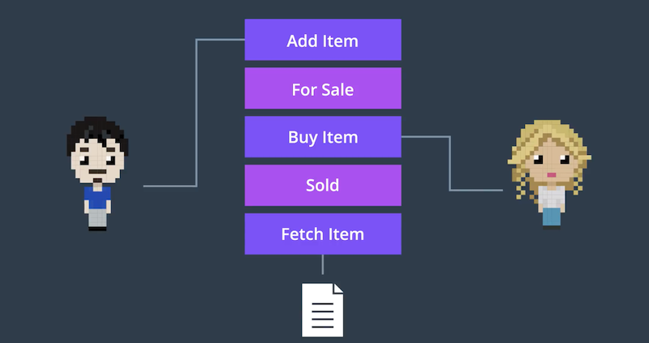

## 이번 절에서 배울 것

- 우리가 앞으로 만들 프로젝트가 해결해 줄 상황에 대한 시나리오를 수립
- 우리가 만들 스마트 컨트랙트의 목표 정의
  - 이것을 기반으로 주요 구성 요소를 도출해낸다

## Lemonade Stand

- 간단한 예시 (현실은 이보다 더 복잡하다)
- 대신에 우리는 코드 구현의 세부 사항에 집중한다

### 설명

- 레몬에이드를 동네에서 판매하고 있다. 하지만, 더 많은 사람들에게 팔아보자!

### Goals

- **Track Sales of Lemonade**
- **Confidence in Transparency of the Company**

### Goals for Smart Contract

## 어떤 데이터를 모니터할 수 있는가?

- 다양한 선택지가 있다. 선택은 오롯이 우리의 몫.
  - `For Sale`, `Sold`, `Shipped`, `Received`; 지원의 상태
  - `Price`, `Buyer`, `Seller`, `sku(Stock Keeping Unit; 주문고유번호)`; 자원의 Attribute

## 강사의 Approach

- *자원에 대한 Actor의 행위* 를 스마트 컨트랙트의 함수로 만들고자 한다
  - `Add Item`, `Buy Item`, `Fetch Item`
- 또한 *자원의 상태* 를 알 수 있어야 한다
  - 각 자원의 상태가 변경되었을 때에, 알림을 받으면 된다 (→ `event`; `For Sale`, `Sold`)
- 특정 자원을 모니터하려면, 자원을 식별할 수 있어야 한다
  - `name`, `sku`, `price`, `seller`, `buyer` 등의 정보를 활용하자
  - `sku`는 고유값으로서 유지되어야 하며, *`sku`를 생성하는 스마트 컨트랙트를 별도로 사용할 것*
- 각 사용자에게 개별적인 스마트 컨트랙트를 부여하고, 사용자의 역할과 권한에 따라 사용할 수 있는 함수를 다르게 한다
