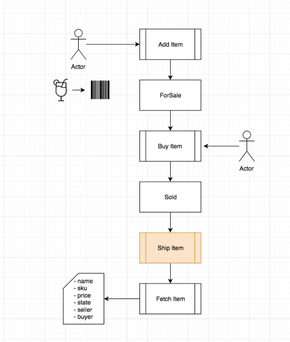

## Challenge: Extending the Supply Chain

At this point you’ve created an entire supply chain from scratch for a simple lemonade stand. This is a great start and it provides an excellent framework from which you can build more complex supply chains.

In this section you’ll do exactly that!

Using the same ideas from earlier in this lesson, you’ll add in a few new features to your smart contract that help track even more details of the products you sell.

Here’s a look at a new diagram that includes the added details.

## Objectives

Our goal is to help you do the following things.

As you can see, this supply chain includes a new function shipItem.

You challenge is to extend the smart contract to include each of these new features. You can use Remix to help create any new code needed to create your version of the extended contract.

[Remix](https://remix.ethereum.org/)

Once completed, owners should have the ability to ship an item that has been sold.
