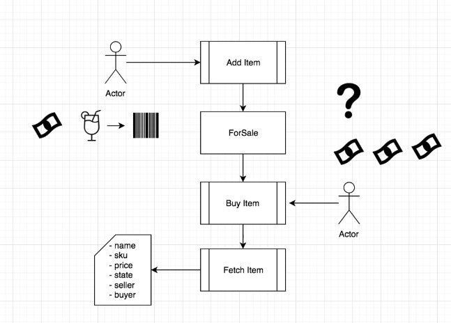

## Challenge: Give a Refund

Customers are loving the transparency of your Lemonade stand! They’re really taking advantage of the ability to have lemonade shipped to their local parties. There’s just one HUGE problem that’s affecting your reputation.

Currently there is no way for your customers to get change for their purchases. They either need to give you the exact amount, or they get cheated out of any extra money they give you. This is unacceptable and it’s up to you to fix this.

## The Challenge

Given the current contract, your challenge is to add the ability to check the value your customer has sent you, and to transfer any extra money given back into their account. This functionality should be made available at the time of purchase.

When you are done, check the solution we came up with to see one possible solution to this challenge.
