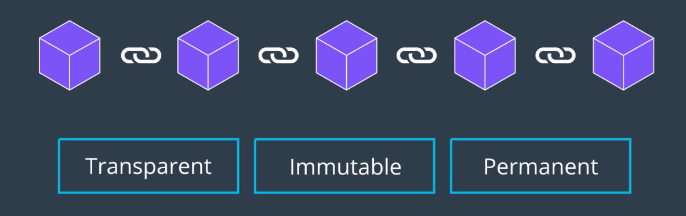

## 데이터의 사적 보호

앞서 강의에서 배웠듯, 블록체인은 어플리케이션의 *진실함* 을 더해주는 아주 중요한 도구이다.

하지만, 공개되어서는 안 되는 데이터는 어떻게 보호할까?

- 개인의 문자 메시지 내용
- 은행 계좌의 거래 내역들

이런 종류의 데이터와 어플리케이션은 사적 보호 기능이 필요하다. 여기서 데이터의 사적 보호란, 당신의 데이터가 안전하게 보관되고, 다른 사람에 의하여 접근될 수 없도록 하는 것이다.

## 데이터 접근 권한의 차등

데이터는 해당 데이터의 소유자, 즉 개별 사용자에게 귀속되고, 사용자는 각자 다른 수준의 사적 보호를 원한다. 어플리케이션을 제공하는 입장에서, 데이터 공개 범위에 있어 사용자에게 선택권을 제공할 수 있어야 한다.

## 이번 강의를 통하여 배울 것

- 블록체인 어플리케이션에서 사적 보호를 강화할 수 있는 테크닉을 배운다
- 탄탄한 이론적 기반을 세우고, 어플리케이션 개발에서 응용할 수 있는 방법을 배운다.
  - 기초적인 Hashing
  - Merkle Trees
  - Ring Signatures
  - Zero-Knowledge Proofs
  - etc...
