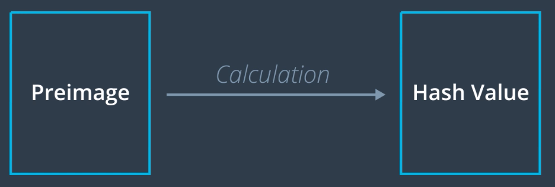
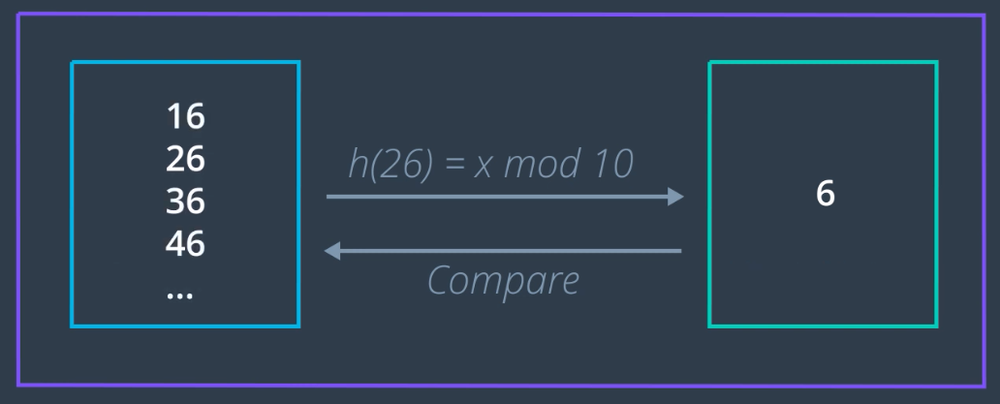
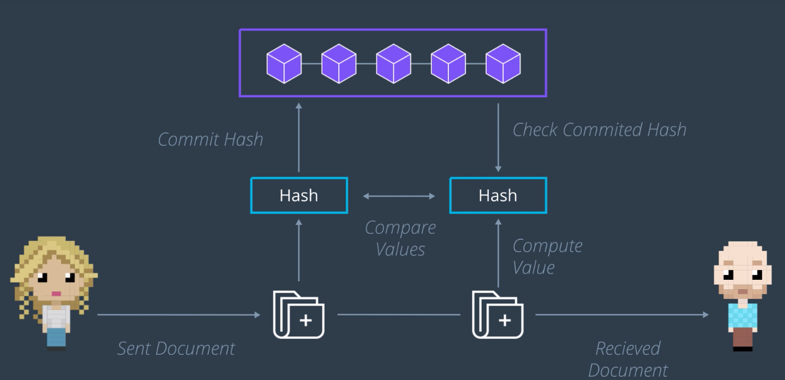

예-전 강의에서 배웠던 것과 달리, 이번 강의에서 배우는 Hashing은 보안을 강화하기 위한 목적의 기술!

## Hash Function

- A mathematical calculation that when applied to any data always computes an answer with the same length
- Hash는 원상(Preimage) 데이터의 지문(Fingerprint)와 같은 것

- 위의 예시의 경우, 항상 첫 자리만을 취하게 된다.
- 실제 지문과 마찬가지로, 우리는 해시값과 원상값을 대조해보며, 서로가 일치하는지 여부를 쉽게 알 수 있다. (일의 자리만 보면 되므로!)
  - 하지만, 해시값만을 보게 된다면 본래의 원상값이 무엇인지 알아내기 힘들다.

### 위의 해시 함수의 문제

- 동일한 해시값을 갖는 원상값을 찾는 것이 너무 쉽다. 따라서, 해당 해시값을 만들기 위하여 실제 어떤 원상값이 사용되었는지를 확실하게 알 수 없다.
- 이런 문제로 인하여, 암호학적 해시를 사용하게 된다.

## Cryptographic Hash

- Calculation performed by the hash function that is based on cryptography
- 즉, 여기서 주어진 해시값은 *원상값이 무엇인지 밝혀내기 매우매우 어렵다*.
  - 하지만, 여전히, 해당 해시값이 올바른 값인지 아는 것은 매우 쉽다. 원상값을 넣어서 함수를 돌려보면 되니까!
- 또한, *해시값이 동일한 2개 이상의 원상값을 밝혀내는 것을 매우매우 어렵다*.

## 암호학적 해시를 어떻게 프라이버시 문제 해결에 사용할까?

- 송신자와 수신자 간에 데이터의 비공개성 유지 (데이터 전체가 아닌, 해시값만을 블록체인에 저장)
- 수신자가 받은 데이터에 대한 무결성 유지 (해시값 대조로 확인 가능)
- 두 가지 목표 달성!
