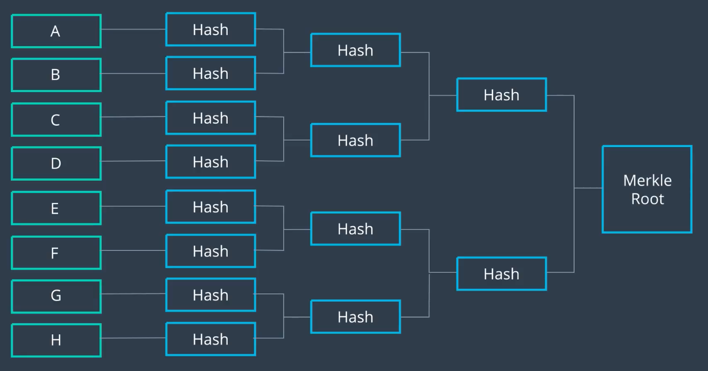

- 암호학적 해싱 기법을 사용하면 데이터 무결성을 지킬 수 있기는 하지만, 떄로는 *데이터를 변경했거나 추가했다는 사실까지도 외부에 알리고 싶지 않을 수 있다*.
  - 어쨌든 블록체인 상에 해시를 기록하게 되므로, 행위가 외부로 드러나게 되는 것.

> 예를 들어, 우리가 어떤 무역 회사를 운영하고 있다고 하자. 외부로 배송을 보낼 때마다 해당 내역이 블록 체인에 해시되어 기록된다면, 경쟁 회사에서는 우리 회사가 *얼마 만큼의* 배송을 보냈는지 알 수 있게 된다.

- 이런 것도 결국은 프라이버시 유출인 것이다.
- 이번 절에서는, 해시에 보다 더 보안을 더하여서, 우리가 만든 해시 개수를 드러나지 않도록 하는 방법을 배운다.

## Merkle Tree를 직접 만들어보자!

- 각각의 원상을 모두 해시해서 블록체인에 개별적으로 업로드하지 않고, 해시를 *단일한 Merkle Root* 로 합친다.
- 머클 트리를 만드는 데에 사용되는 부모 원상의 개수는 정해져있지 않으므로, 사용되는 데이터의 개수는 사용자 마음이다.
  - 홀수 개의 데이터인 경우, 마지막 데이터를 복제해서 짝수 개로 맞춘다.
  - 즉, *사용되는 데이터가 늘어나든 줄어들든 개수를 특정할 수 없다*!
  - 원상 데이터가 몇 개인지 알 길이 없다.

## 데이터 무결성은 어떻게 증명?

- 기존의 상황에서, 수신자가 받게될 것은 단일 데이터의 해시값.
  - 하지만 Merkle Tree를 사용하는 블록체인에 있는 해시값은, 단순 해시가 아니라 `Merkle Root Hash`

### 대안 1: 송신자가 모든 *해시* 를 보낸다

- 수신한 데이터가 Merkle Tree 상에서 몇번째 데이터인지, 어떻게 조합했는지를 안다면, 함께 수신한 다른 해시들을 사용하여서 Merkle Root를 다시 계산할 수 있다. 그러면 함께 수신한 해서 무결성 확인 가능.

### 대안 1의 문제

- 수신한 해시값들이 무결한지 보장할 수 없다
  - 수신한 해시의 무결성을 알려면, 결국 기존과 마찬가지로, 모든 해시를 블록체인에 올려야 할 것.
  - *그러면 원점...*

### 대안 2: Merkle Root를 구하는 데에 필요한 일부 해시만 보낸다

- 원본 데이터와 더불어, 해당 데이터를 기준으로 *Merkle Root를 구하기 위하여 필요한 올바른 순서 상의 데이터 해시들* 만을 함께 보낸다.
- 이론적으로 `log n`개 해시 데이터만 필요 → 상당히 절약
- `Merkle Proof` 라고도 부름

## 특이 사항

- 송신자가 Merkle Tree를 만드는 데에 필요한 원상 데이터의 개수는 제한되어있지 않다
- 원상 데이터 개수와 무관하게 Merkle Root의 크기는 항상 일정하다 → 아주 효율적
