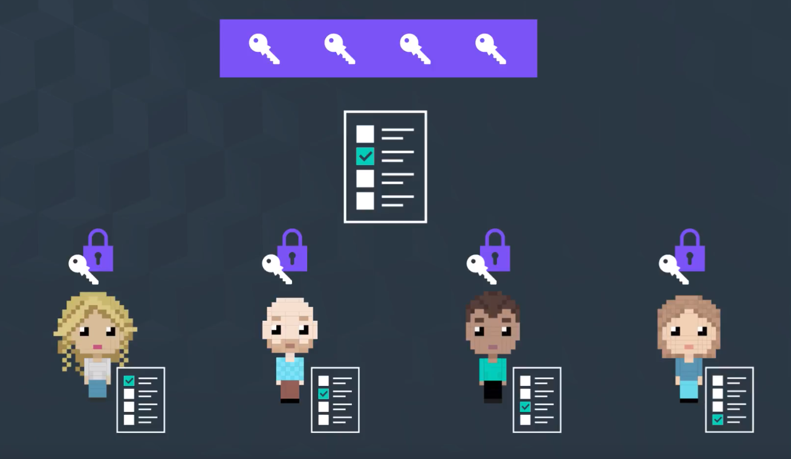

## 영-지식 증명

여기서 말하는 *증명* 이란, `논쟁의 여지가 없는` 증명.

### Incontrovertible; 논쟁의 여지가 없는

즉,

- 해시값이 동일 == 원상이 일치함을 100% 보장
- 특정인의 공개키로 메시지 해독 가능 == 동일인의 비밀키로 메시지를 서명하였음을 100% 보장

### Zero Knowledge

- The person you are proving to doesn't learn anything more than the bare fact that you are proving
- *내가 나의 정보에 대하여 증명을 하고 있다* 는 사실 이외에는, 나의 정보를 일체 공개하지 않는 상태
  - 아래의 트럼프 예시를 보자

### 발상

내가 *반드시 홈런을 치는 비법* 을 알고 있다고 가정하자.

누군가 나에게 그 비법을 알려달라고 했을 때, 내가 그 비법을 직접 알려주는 것이 아니라, *상대방에게 항상 홈런을 쳐내는 모습을 보여주면, 내가 그 비법을 알고 있음을 간접적으로 증명한 셈이다*.

### 주의 - Interactive Proof

1. 만약... 실제로 이 비법을 알아서가 아니라, *단지 운이 좋았던 것이라면*?
  - 그저 *충분한* 만큼 홈런 치는 모습을 보고난 뒤에야 어찌저찌 *믿게* 되는 것.
  - 즉, *홈런에 성공하는 것만 관찰하는 것은 엄밀한 의미로 내가 비법을 알고 있음을 보장하지는 않는다* 는 것.
  - 이런 기법을 *상호작용적 증명* 이라고 함
    - 데이터에 이 기법을 적용할 경우, 이것이 운이 아니라 실제 비밀을 알기 때문에 발생한다고 결론짓기 위하여 여러 차례의 검증이 필요

2. 이 증명은 결국 *당신에게만* 설득력이 있다
  - 제3자는 이를 보고 의구심을 품거나, 두 사람이 짜고 치는 조작이라고 생각할 수 있다
  - 왜냐하면 제3자는 *Interactive Participant* 가 아니기 때문

## Non-Interactive Proof

- Proofs where the secret holder can create a proof without relying on a anyone else
- 즉, 나의 정보를 외부에 공개하지 않고도, 나의 정보에 대한 주장하고 증명한다 → 다른 `데이터`를 통하여 간접적으로

### 예시: 트럼프

- *52장 중에서 한 장을 뽑았고, 내가 들고 있는 카드가 하트-9 일때, 내가 빨간 카드를 들고 있음을 증명하고 싶다. 단, 내가 들고 있는 카드를 공개하고 싶지는 않다.*
  - 나머지 51장 중에서 검은 카드들을 모두 공개한다면, 자동으로 내가 빨간 카드를 들고 있음이 증명된다.
  - 여기에는 제3자와의 어떤 상호작용도 필요하지 않다

## 그렇다면, 데이터에 대한 영지식 증명은 어떤 모습을 보이는가?

### 에시: Ring Signature

- 집합 관계를 이용한 영지식 증명의 대표 사례
- *이 중 어떤 공개키가 쓰였는지 상대방은 알 수 없지만, 어쨌든 나의 것이 사용되었음은 증명 가능*
