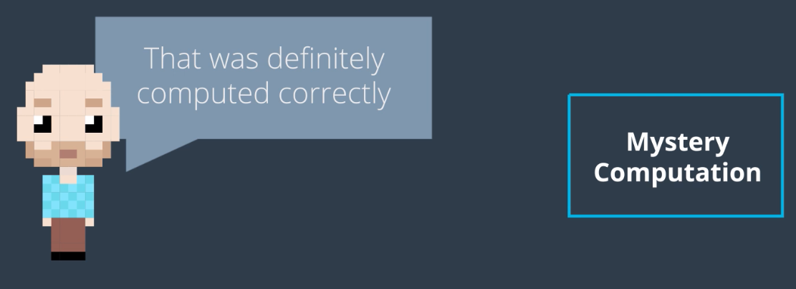
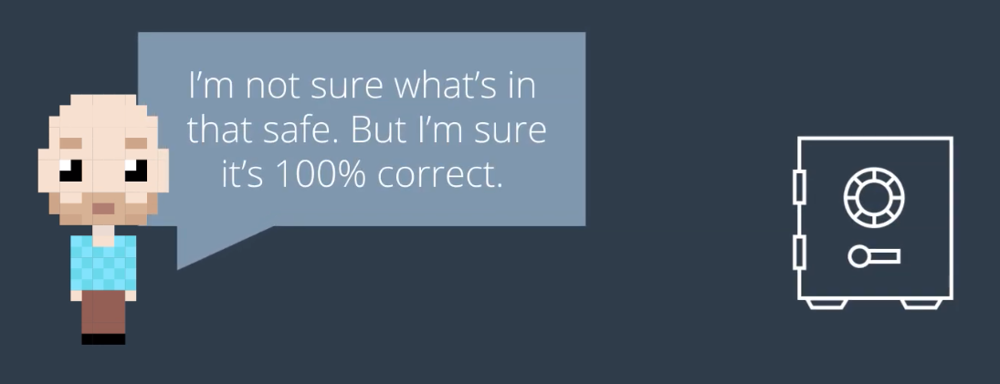
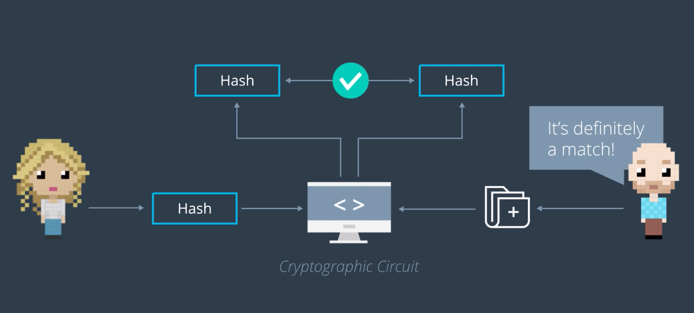
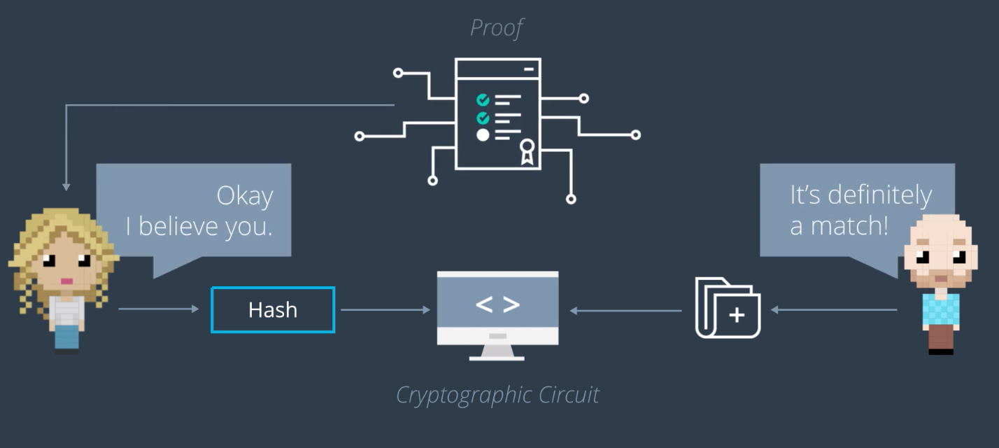
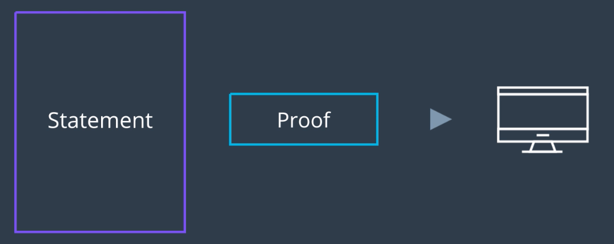

## ZK-SNARK의 고수준 요약

- 누군가 어떤 값을 계산하였고,
- 여기서 값을 계산하는 과정을 실제로 따라 해보지 않더라도 그것이 옳음을 내가 검증할 수 있다는 것에 대하여
- 암호학적인 확신을 가질 수 있는 것

### 사용례

누군가 어떤 비밀 데이터를 보유하고 있고, 해당 데이터를 외부로 공개하지 않더라도 해당자가 데이터를 무결한 상태로 보유하고 있음을 확인하는 작업

### 구체적인 사용례

A가 *어떤 서류를 B가 원본 상태 그대로 보유하고 있는지* 확인하고 싶다고 하자. A는 해당 서류의 해시값만을 갖고 있다.

이런 경우 A는 B에게 사실을 물어볼 수 있지만, 이 경우 B가 진실된 대답을 하는지 100% 확신할 수 없다.

여기서, `Cryptohraphic Circuit`이 도입된다. 이는 컴퓨터 프로그램으로, B가 가지게 된다. 여기서 프로그램은 *A가 보낸 해시값* 과 B가 가진 서류를 입력으로 받는다. B의 서류를 해싱하여서 A가 보낸 해시값과 비교하게 된다.

### 이점

- B는 자신이 가진 서류의 내용을 외부에 공개할 필요가 없다
  - A는 해시만 제공하고, B는 자신의 로컬 환경에서 서류에 대하여 직접 해싱한다
- B는 프로그램이 바람직한 결과를 출력하도록 하기 위하여, 입력 인자들을 조작할 수 없다.
  - A는 프로그램이 반환한 결과를 완전 신뢰할 수 있다: B가 프로그램을 정상적으로 작동시켰고, 무결한 서류 데이터를 보유하고 있음

## ZK-SNARK

- `Z`ero `K`nowledge - `S`uccinct `N`on-interactive `AR`gument of `K`nowledge
- A way to quickly prove something, without interacting with anyone else, in a way that is difficult to hack, can't be replicated, and can be done without you needing to tell anyone what you are trying to prove.
- 각 요건이 무엇을 가리키는지 살펴보자.

### Zero-Knowledge

- 증명하는 사람이, 증명하려는 데이터의 내용을 상대방에게 알려줄 필요가 없다
- 이 뒤에 이어지는 특질들은, 기존의 다른 영지식 증명에 비교하여 차별점을 만들어주는 특질들

### Succinct

- 여기서 말하는 *간결함* 이란, 생성되는 Proof의 크기 측면 → 증명하는 사람이 소유하는 해당 정보의 크기에 비하였을 때
- 이는 *데이터의 쓰기/저장 작업의 비용이 높은 블록체인* 에서는 아주 중요한 요소

### Non-Interactive

- 누구에게나 충분한 증명임
- *체인 상의 그 누구와도 상호작용적인 증명 세션을 운영할 수 없는* 블록체인 환경에서는 아주 중요한 요소
  - 신뢰 기관이 없는 탈중앙화된 구조이므로...

### Argument

- 여기서 말하는 주장은 *증명(Proof)* 을 말한다
- 암호학에서 `Argument`와 `Proof`의 차이는 아주 미묘하다 → 여기서 자세히 다루지는 않음

#### Argument와 Proof의 차이: 법정의 예시

- 법정에서 변호사가 어떤 사실이 참임을 증명하고자 할 때, 변호사는 이를 뒷받침하는 `주장(Argument)`을 말한다.
- 여기서 각 주장에 대한 증거와 논리들은 사실 관계를 `증명(Prove)`하는 데에 사용된다.

### Knowledge

- 당신이 외부로 드러내지(Reveal) 않고서 증명하고자 하는, 보유하고 있는 정보
