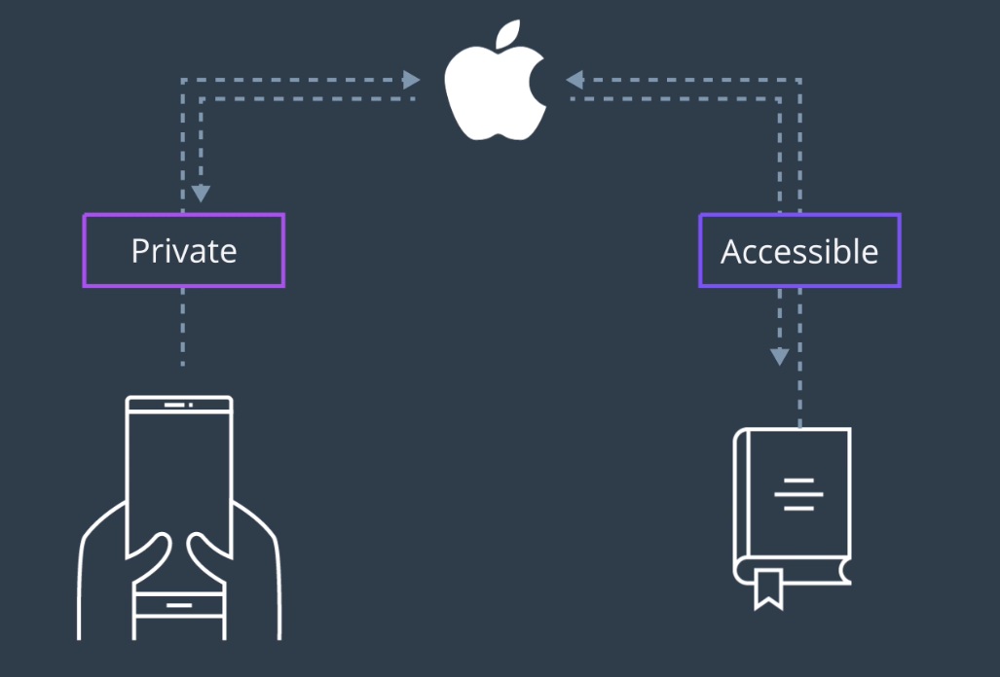
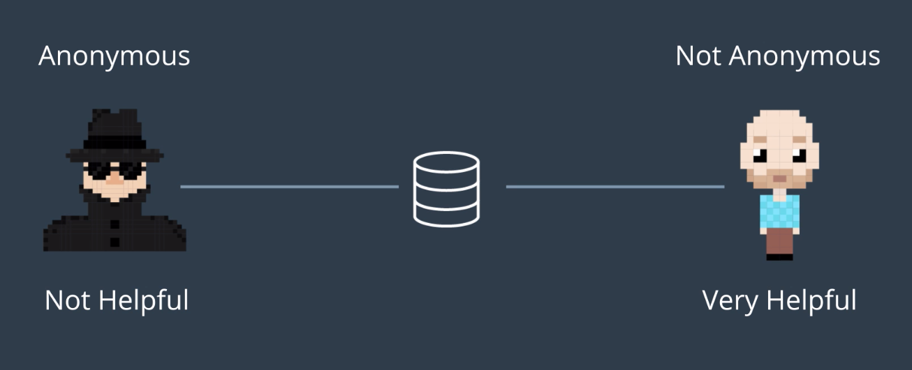
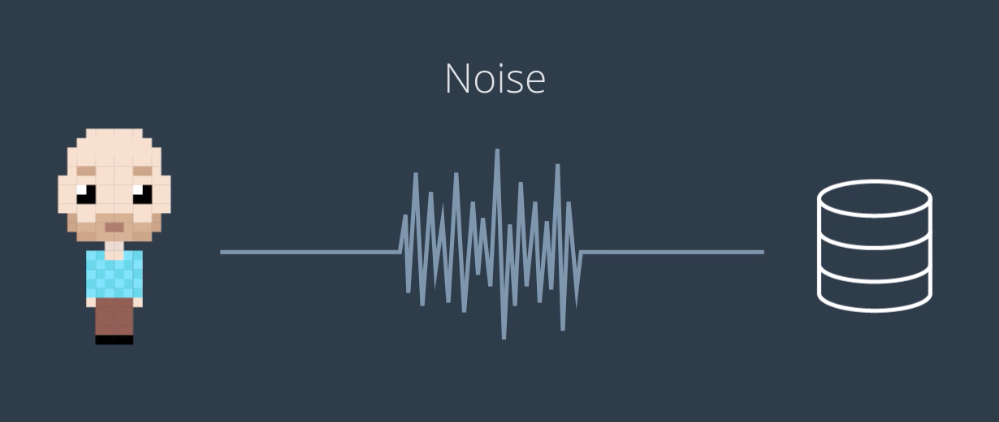
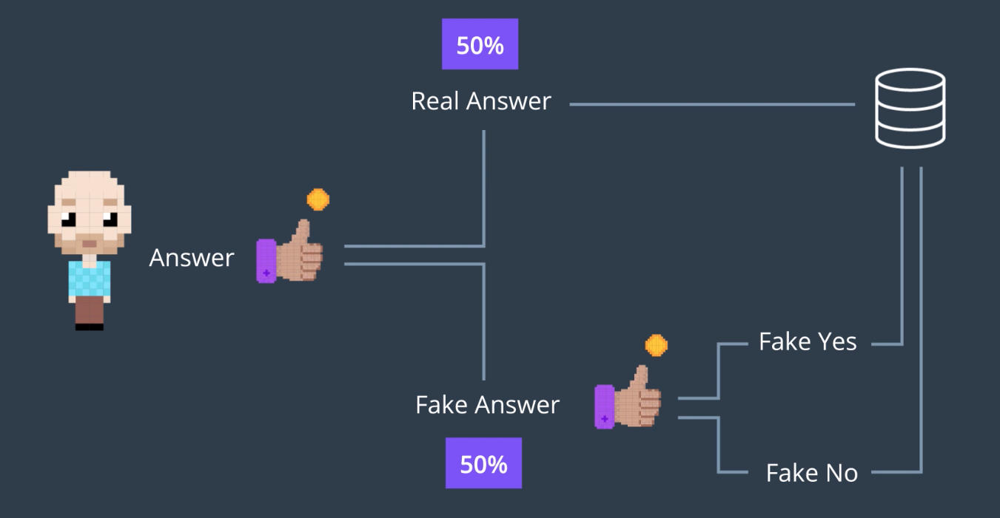
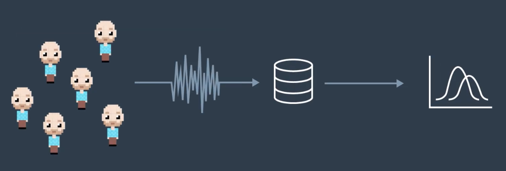

- 회사는 사용자의 데이터에 접근하여, 해당 데이터를 활용하여 회사 제품의 성능과 사용성을 높이고자 한다.
- 반면 사용자는 회사가 자신들을 일일이 추적하기를 원하지 않는다. 이는 프라이버시이기 때문.
- 이러한 상충되는 상황에서 사용될 수 있는 기술이 `Differential Privacy`이다.

## Differential Privacy

- A technique used to maximize both the usefulness of a set of data as well as the privacy of the individuals within that dataset
- 즉, 데이터를 활용하면서도 사생활을 보호한다
  - 특정 사용자들의 데이터를 수집하여 정보를 만들어내면서도, 데이터 소유자에 대한 정보를 드러내지는 않도록 한다

## 이것이 왜 중요할까?: 사례로 알아보자

- 위 서비스들의 주요 기능:
  - 사용자의 사용 패턴 분석
  - 한편, 각 데이터로 말미암아 원 소유자를 추적하지 못해야 함
- 또한, 우리의 경우 이러한 데이터들이 탈중앙화 환경에 전송될 수 있는 방법을 생각해봐야 한다

### Google Maps

- 사용자는 해당 어플리케이션과 GPS 기능을 활용하고, 당신이 여행하는 과정에서 수많은 데이터가 생성된다.
  - 하지만 해당 데이터로부터 구글이 사용자의 개인적인 여행 습관 등을 학습하는 것을 사용자는 원하지 않을 것.
- 구글은 이 데이터를 통하여 서비스를 향상시키는 데에 활용하고자 함
- Differential Privacy 테크닉을 사용하면, 수집된 데이터는 특정 개인에 대하여 학습하는 데에 사용되는 것이 아니라, *모든 사용자들의 일반적인 사용 습관 등을 분석하기 위한 대규모의 데이터 콜렉션으로서 군집화된다*.
  - 이를 활용한 예시는 특정 시간대의 교통 상황 패턴 분석을 들 수 있다.

### Google Chrome

- 개인의 검색 기록을 모조리 열람하지 않고도, 웹 브라우징 행위에서 트렌드를 분석해낼 수 있다

### Apple Keyboard

- Google Maps와 마찬가지
- 사용자는 개인화된 데이터를 생성해내고, 애플은 이 데이터를 통하여 *사용자가 사용하고 있지만, 사전에는 등재되어있지 않은 단어* 등을 분석해낸다.
  - 애플은 Differential Privacy 테크닉을 사용하여 사용자의 사생활을 침해하지 않는 선에서 데이터를 수집한다.

## 차라리 수집되는 데이터에서 개인 정보를 제외해버리면 되지 않을까요?

- 생각보다 효율적이지 못한 해법
- 익명화된 데이터는 사실 익명화되지 않았거나, 가치가 없는 경우가 많기 떄문
  1. `Linkage Attack` 등의 기법을 사용하면, 데이터 분석가들은 익명화된 데이터 집합으로부터 개인 정보를 추론해낼 수 있다. 그리고 이는 상당히 정확하다.
  2. 익명화가 심해지면, 해당 데이터로부터는 의미있는 정보를 추출해내기가 힘들다.

## Differential Privacy의 적용

- 수집하는 데이터에 임의의 노이즈를 적용
- 개별 사용자에 대하여 완전하게 정확한 데이터 수집을 하지 않음으로서, 개별 사용자를 역추적하지 못하도록 하는 것

### 예시: 설문조사

- 1000명에게 O/X로 답할 수 있는 설문을 진행
- 답변 수집시, 단순히 답변을 그대로 수집하지 않고, 임의의 노이즈를 적용한다.
  - 한 답변자의 답에 대하여, 50%의 확률로 가짜 답변을 주입
  - 가짜 답변의 경우 50%의 확률로 O/X가 결정

- 이렇게 하면, *어떤 답변 결과가 답변자의 진실된 답변인지* 유추하는 것이 불가능해진다
  - 누구나 평등하게, 50% 확률로 노이즈가 섞인 답변으로 입력되었을 가능성이 생기는 것이다

- 또한, 데이터 분석가는 이와 같이 랜덤 노이즈의 존재를 알고, 감안하여 분석하기 때문에, 이러한 노이즈를 보정하고, 실제로 정확한 응답을 한 사람의 수를 보외(extrapolate)하여 추정하게 된다.

## 정리

- 위의 설명은 실제 랜덤화와 분배 상황에 비했을때 다소 간략화된 설명이지만, 기본적인 개념은 같다.
- 장점도 있지만, 복잡하게 만드는 요인들도 있다.
  - 노이즈가 섞이기 때문에, 데이터 집합의 크기가 커야 잘못된 분석을 피할 수 있다
  - 보호된 답변들이 유출되지 않도록 추가적인 절차가 필요하므로 구현이 보다 어렵다 (??)
