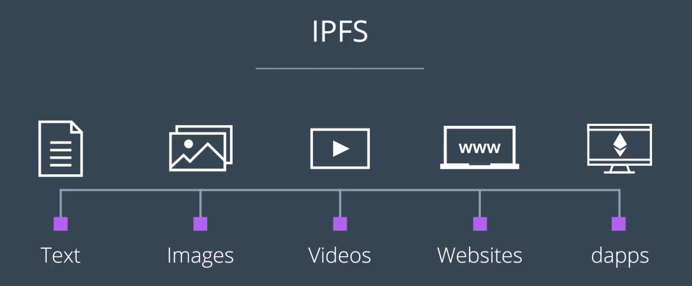

이번 강의에서는 탈중앙화 파일 시스템인 DFS에 대하여 배운다.

## Contents Overview

- DFS는 주요 인터넷 프로토콜을 대체하고자 함; 특히 HTTP
- DFS가 이더리움 네트워크 상에 완전 탈중앙화된 무정지 어플리케이션을 제작하는 데에 어떤 역할을 담당하는지
- DFS의 구현 중, IPFS(InterPlanetary File System)에 대하여 알아본다

## IPFS의 목표

- 우리가 현재 데이터를 주고 받는 데에 사용되는 HTTP 프로토콜은 대체하는 것
- 이를 통하여 공유 네트워크 구조 상에서 중간자(서버) 없이 정적 파일들을 교환할 수 있다

## 이번 강의의 목표

- 이 강의를 다 듣고, IPFS를 통하여 정적 페이지를 호스팅할 수 있다
- 단순 블록체인 백엔드뿐만이 아닌, 프론트까지도 블록체인으로 제공하는 Full-Dapp을 제작한다
