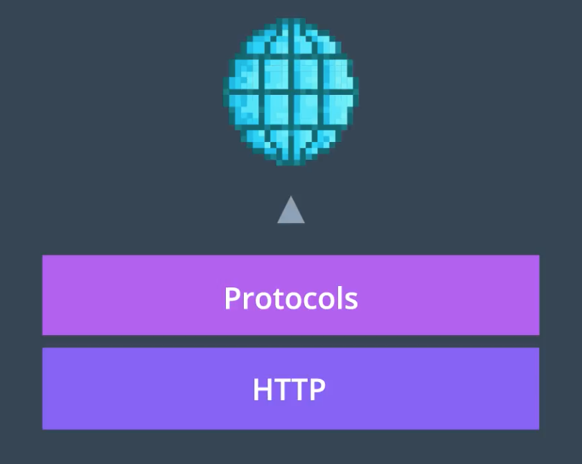
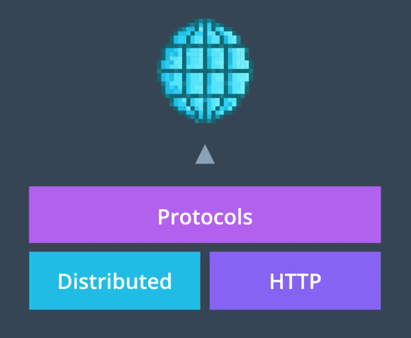
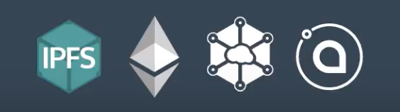
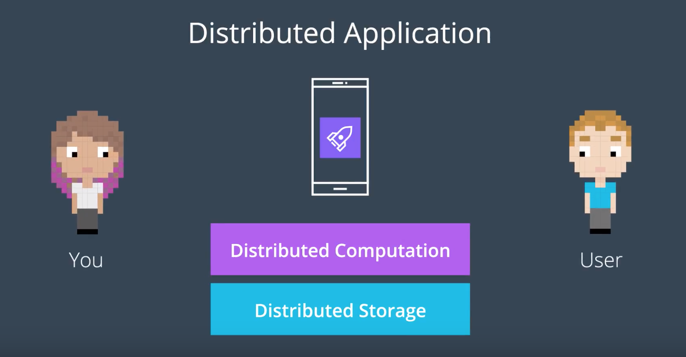

코드와 구현을 맛보기에 앞서, 주요 개념들을 몇 가지 살펴보자

---

## 탈중앙화된 저장 시스템은 기존의 해결책과 무엇이 다른가?

아니, 좀 더 본질적인 질문을 던져보자.

## 인터넷이란 무엇인가?

> Collection of Protocols or rules meant to decide the best way to move and share information across a network

여기서 프로토콜들이란, 예로부터 개발자들에 의하여 좋은 제안으로 여겨져왔고, 끝내 Best Practice로서 수용된 것들이었다. 이러한 양상은 현재 블록체인 계에서도 확인할 수 있다. 현재 블록체인을 중심으로, 새로운 인터넷 환경과 프로토콜에 대한 논의가 활발하게 이루어지고 있기 떄문이다.

### 현재의 웹은 HTTP가 지배하고 있다

엄밀히 말하면, HTTP는 *메시지가 웹 상에서 어떤 형식을 갖추고, 어떻게 전송되는지를 정의한 프로토콜* 이다. 또한 *웹 서버와 웹 브라우저가 특정 명령에 대하여 어떤 동작을 취할 것인지* 를 정의한다.

이 프로토콜은 지금까지 잘 사용되어왔지만, 블록체인 계와 마찬가지로, 사람들은 더 개선될 수 있다고 생각했다. 그래서 등장한 것이 *분산 저장 장치* 의 개념이다.

이를 통하여 HTTP를 대체하고, 웹 상에서 데이터가 갖출 형식과 전송 방식을 재정의하고자 한다. DFS는 *탈중앙화*, *P2P 네트워크* 등과 같은 블록체인의 주요 원칙들을 모두 아우르면서 이를 파일 시스템에 적용하고자 한다.

비트코인이 특정 금융 신뢰 기관에 의하여 금융 거래가 통제 및 관리되는 것을 원하지 않았던 것처럼, DFS 또한 웹 상에서 오고가는 데이터가 특정 테크 회사에 의하여 통제 및 관리되는 것을 원하지 않는다. 예를 들어 Netflix, Facebook, Google, Amazon 등의 회사는 고유의 특별한 서비스들을 아주 많이 제공하는 멋진 회사들이지만, 우리가 해당 플랫폼을 사용하여 발생시키는 정보와 데이터는 모두 해당 회사의 소유물이다. *해당 데이터를 어떻게 공유하고 저장할지에 대한 선택은 각 회사가 오롯이 갖는 것이다*. 또한 그들은 우리가 아는 정보는 물론, *우리가 모르는 정보들까지 모두 통제할 수* 있다. 설령 각 회사들이 선의를 가지고 있다고 하여도, *정부에 의하여 웹이 통제될 수 있는 가능성은 항상 열려있는* 것이다.

만약, 정부가 우리의 인터넷 접근을 통제하고 관리한다면? 우리는 Google을 매일 사용하지만, 중국, 중동 일부 국가 등에서는 해당 서비스의 사용이 금지되어있다. 이러한 정보 공유의 제한이 *Global Community* 로의 발전을 저해한다.

## 다양한 시도의 등장

- IPFS: 가장 유명
- Swarm: Ethereum이 제작하는 프로젝트
- Storage
- SIA

## 우리가 만드는 DApp과 찰떡궁합

- Ethereum은 DApp에서 연산 부분만 담당; 여기에서 자료를 저장하는 것은 아주 비싼 행위
  - 여전히 데이터 저장을 하거나 프론트 서비스를 호스팅하려면 클라우드 저장소를 이용하거나, 기존 방식으로 서버를 운용해야만 함
  - 여전히 중앙화된 데이터!
- 이것을 어떻게 해결할지는 의견이 분분하지만, DFS는 탈중앙화된 DApp에 대한 맞춤 해결책 중 하나로서 제안되었다.
