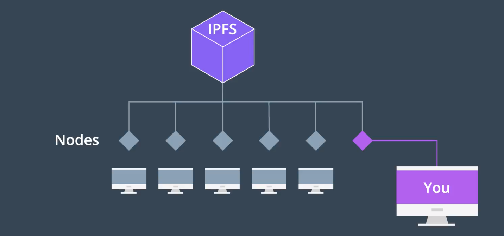
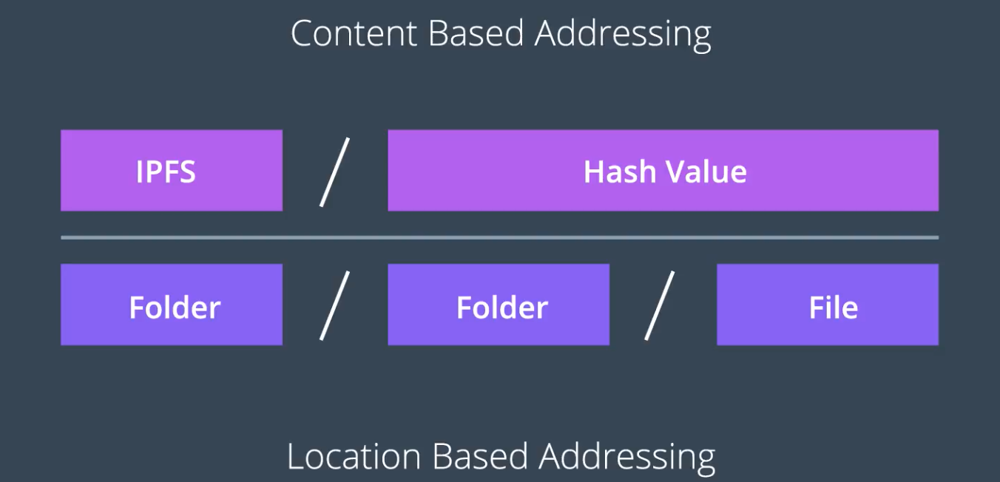

DFS의 등장배경, 목표, HTTP와의 관련성 등을 알았으니, 이제 본격적으로 IPFS에 대하여 알아보자. 여러 도구 가운데 IPFS를 사용하는 것은, 이것이 현재로선 가장 개발이 많이 되었고, 입문하기 딱이기 때문

---

## IPFS는 즉시적인 파일 공유 프로토콜(Immediate File Distribution Protocol)

- 프로토콜는 새로운 것이지만, 발상 자체는 오래되었다.
  - BitTorrent, Napster 등과 유사
  - P2P 탈중앙화 미디어 프로토콜
- 이러한 네트워크 디자인에서는 파일이 여러 노드들에게 분배되어 다운로드 및 공유가 이루어진다. 해당 네트워크에 참가중인 노드들 간에 파일을 업로드/다운로드 가능하게 해준다.
- 이 네트워크에 참가하려면 PC에 IPFS 프로그램을 설치하면 된다
  - 설치가 완료되면 즉시 파일을 함께 공유할 수 있게 된다.
  - 한번 공유된 데이터는 다른 중간자 또는 회사에 의하여 차단되거나 삭제되지 않는 그러한 파일 커뮤니티에 참가하는 셈이다.

## IPFS로는 모든 종류의 파일을 공유할 수 있다

- 심지어 DApp 까지도!
- 요금은 부과되지 않는다.
- 이후 실습을 통하여 다양한 유형의 IPFS 사용례를 다룰 것

---

## Content-Based Address

- IPFS가 파일을 저장하고 관리하는 데에 사용하는 발상
- 기존에 HTTP에서 인터넷 상의 어떤 자원을 가리킬 때에 사용했던 방식은 `Location-Based Address`이다

### Location-Based Address

- 우리에게 친숙한 방식; URL 방식
- 파일들은 *해당 파일이 현재 위치한 곳* 을 기준으로 참조된다.
  - `디렉토리` 기준

### 이 방식의 문제: 컨텐츠 위치가 변경되었으면?

- 우리가 잘 아는 `404 Not Found` 오류로 이어진다.
- 위치가 변경되거나, 삭제될 경우, 링크를 항상 수정해줘야 한다

## 해결: 각 파일에 대하여 고유한 해시값으로 식별하자

- 마치 블록체인 상의 블록과 같은 것
- 어떤 컨텐츠에게 영원히 귀속되는 관련값
  - 파일에 대하여 해시를 돌리면 항상 동일하게 반환되는 유니크한 해시값을 사용
- 물론 여기에도 문제점이 있기는 하다 → 이후에 설명

---

## 블록체인 기반 웹 서비스의 구조 Overview

아래의 도식을 통하여, `개발자`와 `사용자` 사이에 어떤 구성 요소들이 어디에 위치하는지 간략하게나마 파악해보자

### 우리의 목표

사용자가 웹 브라우저를 통하여 접근할 수 있는 블록체인 기반의 DApp

- 개발: Truffle Framework를 통한 개발과 테스트, 배포
- DApp 실행을 위한 블록체인 컴퓨팅 파워: Local Ethereum Node / `Infura`를 통한 외부 노드와의 연결
- DApp과 기타 정적 자원을 호스팅하는 스토리지 서버: IPFS
- 사용자가 DApp 시스템을 사용하는 인터페이스: Google Chrome with `Metamask`
  - 비록 IPFS가 현재 웹 브라우징을 대체하고자 하는 의도로 등장했지만, 현재 주류가 아직 HTTP이므로 무시 못함!
  - 브라우저까지 탈중앙화를 원한다면, `Brave Browser` 등을 고려해보자

---

## 궁금증

- 내가 어떤 파일을 나의 IPFS에 올리면, 자동으로 다른 노드들의 로컬 디스크에 이것이 분배되는 것인가?
  - 그렇다면, 역의 경우도 성립하는가?
- IPFS 참여의 대가가 있는가? 블록체인처럼?
- 다른 사람과 공유하는 분배 스토리지이지만, CRUD 권한은 원 소유자만이 갖는 것인가?
