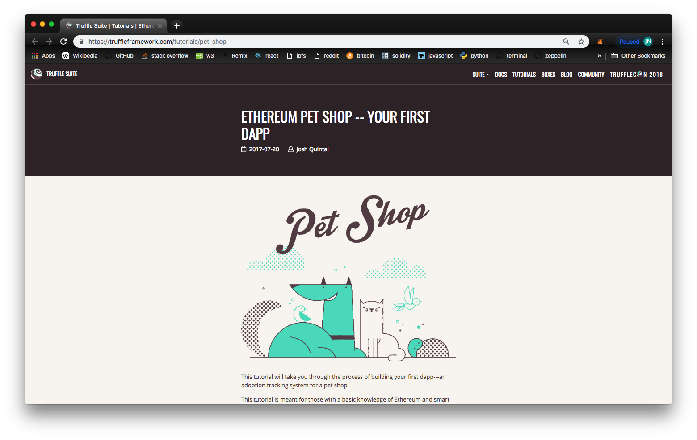

In this section, we’re presenting you with one final challenge using ipfs. We want you to take decentralized app, and host it on ipfs, creating a fully decentralized application. To do this, we’ll be using a dapp you were introduced to in earlier lessons, known as the pet shop dapp.

If you haven’t done this, you can access the tutorial [here](https://truffleframework.com/tutorials/pet-shop).

This is a decentralized app you can get up and running with quickly using a truffle box. The tutorial they provide walks through the details of how to get up and running with this app. At this point, if you’ve completed the tutorial, you should have a Dapp you can access on your local host.

Their documentation is extremely well detailed and hopefully you don’t run into any trouble getting started.

Once you are familiar with this dapp, you can update the code to do make it do anything you’d like. The core functionality here is the ability to show pets that are available for adoption and allowing users to adopt them. With some creativity, you can replace some images and code to do other things like a card trading dapp, a way to sell clothes, or anything else you can think of.

Once you’ve completed your version of the app, you can publish it to IPFS using the same techniques shown throughout this lesson.

### Tips and Tricks

There’s one thing we haven’t done yet that it will be important to keep in mind when publishing your dapp.

Previously, we uploaded the entire website directory to IPFS. Normally, you would want to publish only the assets necessary to host your dapp effectively.

To do this, you can create a new folder within your directory to copy the assets into. By convention, we call this a ‘dist’ folder, which is short for ‘distributed files’.

> 나의 경우는 `/public` 을 쓰거나, `/production`을 쓴다.

What this means is that once you create your app you’ll need to do a few things.

- Create a folder named dist within your app directory.
- Copy the html, javascript, css, and media files necessary to host your application into this folder.
- `ipfs add` the dist folder to IPFS
- `ipfs name publish`

Once you do this, you’ll have a fully decentralized application hosted on IPFS!
