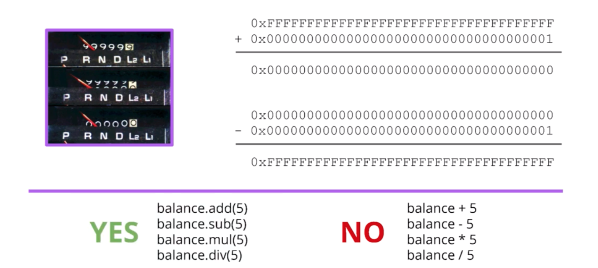

## 스마트 컨트랙트에서 Overflow와 Underflow

- 차량 마일리지가 리셋되는 현상과 유사한 일이 스마트 컨트랙트에서도 발생할 수 있다. 이런 일이 없도록 도와주는 것이 `SafeMath`
- OpenZeppelin에서 만든 오픈 소스 라이브러리
- Solidity 내장 연산자 대신, 라이브러리가 제공하는 안전한 연산자를 사용하자
  - 강사는 어떤 컨트랙트에서든 이 라이브러리를 반드시 사용할 것을 권장. 언제 상황이 발생할지 모르므로
