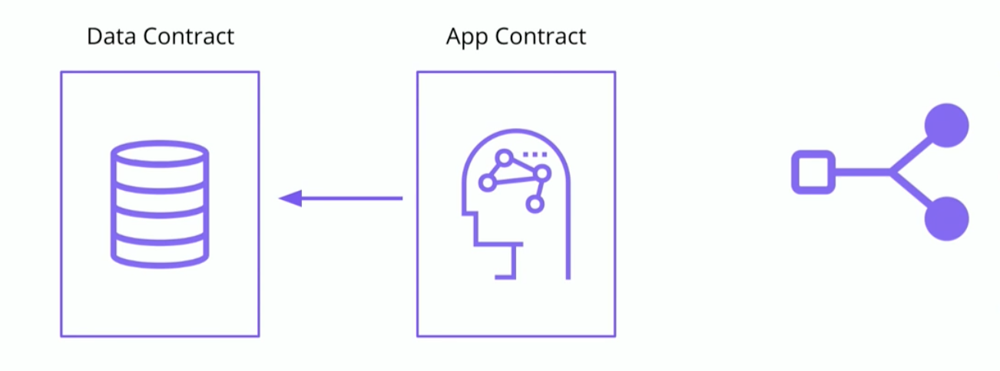

데이터와 로직을 분리하는 것이 이번 강의에서 초점을 두는 방식

## Data Contract는 신뢰할 수 있는 컨트랙트에게만 데이터를 제공한다



위 그림에서 화살표 방향을 잘 살펴보자.

**`Data` 컨트랙트는 데이터를 제공하기 위하여 스스로 먼저 메서드를 실행하지 않는다**. 반드시 외부의 `App` 컨트랙트가 `Data` 컨트랙트에 대하여 메서드를 호출하는 식이며, `App` 컨트랙트는 `Data` 컨트랙트가 신뢰할 수 있는 컨트랙트이어야 한다.

### 의문: 이렇게 되면 `Data` 컨트랙트가 가진 메서드를 호출하기만 하면 데이터에 접근할 수 있는거 아닌가?

그건 맞다. 이렇게 데이터와 로직을 분리하는 순간, 임의의 컨트랙트가 `Data` 컨트랙트에 접근하여 데이터를 뺴갈 수 있는 위험을 만드는 것. 프로토콜만 맞추면 빼갈 수 있을 수도 있으니까. 이런 위험성을 해소하는 것이 개발자인 우리가 코드 구현을 통하여 해결할 일이다.

> #### Why is it advantageous to separate data and application logic into separate contracts?
> If a bug is discovered in the application logic, a new contract can be deployed without losing data.

## Exercise 1: 하나로 이루어진 컨트랙트를 2개의 컨트랙트로 분리

- `Profile` 구조체 내에 근로자에 대한 정보를 입력
- 근로자를 등록하기 위한 각종 메서드들이 존재
- 근로자가 상품 거래를 발생시키면, DApp이 이에 대하여 해당 근로자의 보너스를 계산(`calculateBonus()`)
- 특정 시점이 되면 각 근로자들이 컨트랙트로부터 보너스 액수에 상응하는 금액을 인출할 수 있다

### 만약, 컨트랙트 코드에 문제가 있다면?

보너스를 계산 공식이 바뀌어서 해당 메서드를 수정해야 하는 상황을 가정하자. 이미 컨트랙트가 배포되고 있다면, 이를 수정하는 것은 불가능하다. 해당 컨트랙트에 들어있는 State들이 모두 사라질 것이기 때문.

기존에 존재하는 각종 데이터를 유지하면서도 프로그램 로직을 바꾸려면? 결국 로직과 데이터를 분리해야 한다; 마치 Backend에 서버와 DB가 분리된 것처럼.

### 실습 코드 환경 설정하기

1. 브랜치 전환
```bash
$ git checkout ExerciseC6C && npm install
```

2. Create application contract
  - Add file `contracts/ExerciseC6C/ExerciseC6CApp.sol` by copying the code from `snippets/C/ExerciseC6CApp.txt`

3. Move application logic from `ExerciseC6C` to `ExerciseC6CApp`
  - Move `calculateBonus()` function
  - Move `addSale()` function

4. Create temporary stub for `updateEmployee()` in `ExerciseC6CApp`
  - 메서드를 이동함에 따라 일부 작동하지 않을 로직에서 오류가 발생하지 않도록 하는 임시 조치
  - 시그니처 그대로 옮겨온 뒤, 빈 함수로 선언해주면 된다
  - 경고가 많이 생성되지만, 컴파일에는 문제가 없으니 안심 → `artifacts` 파일이 생성되면 장땡
  - 컴파일을 여러번 수행할 경우, `build/` 폴더에 옛 버전 코드들과 충돌이 발생할 수 있으니, 주기적으로 삭제해주자

5. Run `truffle compile` and ensure code compiles

> #### When separating a contract into separate Data and Application contracts, what development technique enables you to gradually perform the task while ensuring the code continues to compile?
> add data contract function stubs to application contract

### 예상 오답: Move all Data contract functions into a library and reference it from the Application contract

앞서 `SafeMath` 라이브러리를 사용한 것처럼, 이것도 그런 접근을 취하면 되지 않을까? 라고 생각할 수 있다.

`Library`는 배포되는 컨트랙트와 함께 *해당 배포(Deployment)의 일부분* 으로서 블록체인에 배포된다. 컨트랙트에는 해당 라이브러리가 배포된 뒤의 주소가 포함되는 것이다. 이 경우, 배포가 한번 이루어진 라이브러리는 해당 라이브러리가 포함된 컨트랙트로부터 빼내서 재활용하는 것이 불가능하다. 따라서 이것은 *분리* 라고 할 수 없다. (매번 배포할 때마다 새로운 라이브러리 인스턴스가 생기는 셈)
