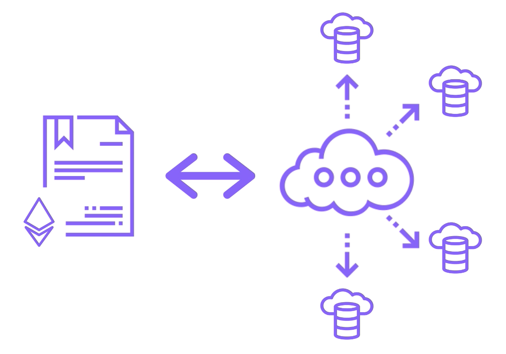

## What are Oracles?

> ### Oracles
> Gateways used by Smart Contracts to interact with the outside world

스마트 컨트랙트는 한번 블록체인 내에 배포되고나면, 블록체인 외부에 있는 데이터에 접근할 수 없다. 필요한 경우, 외부로부터 데이터를 가져올 수 있는 일련의 메커니즘이 필요하다.

### 고수준 도식

1. 스마트 컨트랙트와 오라클이 각각 존재
  - 경우에 따라 오라클은 2개 이상일 수 있다
2. 스마트 컨트랙트가 오라클로 요청(`request`)을 보낸다
3. 오라클은 스마트 컨트랙트로부터의 요청을 받아 파싱한 뒤 해석한다
4. 자신이 가진 API들을 활용하여 적절한 데이터를 받아온다(`fetch`)
5. 데이터를 정리하여(`package`) 거래에 담고, 요청한 스마트 컨트랙트에게 보내준다

## Examples of Oracles: 스마트 컨트랙트 그 자체로는 외부 데이터를 가져올 수 없다

### Flight Insurance

예약한 항공편이 지연되거나 연장되었을 때에, 해당 보험에 가입한 고객들은 고객센터에 가서 서류를 작성하는 등의 복잡한 과정을 거치는 것이 아니라, 자동으로 환불받는다

### Shipping

GPS 추적을 통한 화물의 위치 추적. 여기서 GPS는 조작될 수 있다는 점에서, 신뢰할 수 있는 오라클은 스마트 컨트랙트에 확실히 신뢰할 수 있는 화물 위치를 알려준다.

### Finance

이더리움의 현재 가격 데이터를 불러와야 하는 스마트 컨트랙트를 사용하는 경우를 생각해보자. 또는 이더리움을 통한 다른 토큰 환전율을 파악해야 할 수도 있다.

## Oracle as a Service

여기서 자세히 다루지는 않지만, 간편하게 오라클 서비스를 이용할 수 있도록 제품을 만드는 회사가 많다~

---

## Trusted Oracles

- Oracles that are known to be secure, reliable and resistant to manipulation
  - 일반적인 조직 내부에서 사용하는 폐쇄 오라클이라고 할 때, `스마트 컨트랙트 개발팀 === 오라클 개발팀` 인 경우가 많다
- Typically used in *private blockchain* scenarios
- *Centralized, single* point of failure; 폐쇄적이니 그럴 수 밖에
  - 특정 오라클이 제대로 작동하지 않으면, 이에 의존하는 서비스도 따라서 작동하지 않는다
- Act as a proxy for Smart Contract to access external data
  - Limited to private business use

> ### What is the primary purpose of oracles?
> To securely provide off-chain data to Smart Contracts
