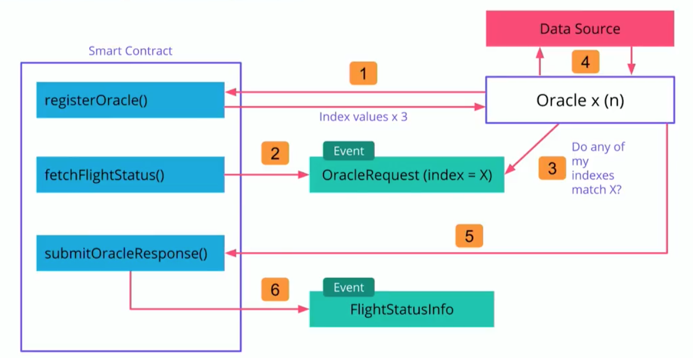

## Oracle Architecture (as Exercise)

오라클을 사용할 컨트랙트에서 가져야 하는 메서드들을 비롯하여 각종 구성 요소를 알아본다. 단계 별로 살펴본다.

### 1. `.registerOracle()`

해당 컨트랙트에서 사용할 오라클을 등록하는 메서드. 컨트랙트에 대하여 악의적인 행위를 할 수 있는 오라클을 스크린하기 위하여 등록에는 소정의 금액(*deterrent*)이 요구된다. 일정 금액의 비용 부과를 먼저 유도하고 의무화하는 것은 지분 투자와 유사한 형태이다. 오라클에 의하여 조성된 기금은 여러 가지 용도(Bounty 등)로 사용될 수 있으나 이번 실습에서는 따로 사용하지는 않는다.

별도 메서드가 있는 데에서 알 수 있듯 한 컨트랙트에는 1개 이상의 오라클이 등록될 수 있다.

### 2. 오라클에 Key 전달

`.registerOracle()`의 결과로 `세 자리`의 임의 정수값이 오라클로 반환된다. 이 방법은 유일한 것이 아니며, 이번 실습에서 채택한 방법이다. 이를 통하여 오라클이 자신 이외의 다른 오라클에 대한 식별을 불가능하도록 만든다. `Oracle Participation의 Randomization`이다.

이 키를 이용하여, 해당 오라클은 전달받은 키가 포함된 요청에 대하여서만 요청에 응하고 상응하는 응답값을 반환해준다.

### 3. `fetchFlightStatus()`

항공기의 상태, 이륙 및 착륙 상태 정보를 오라클에 요청하는 메서드(다음 연습 프로젝트의 내용과 연관). 오라클의 생명주기를 시작시키는 트리거 역할. DApp의 클라이언트 부분에 의하여 실행될 것.

### 4. `OracleEvent(index = X)`

일반적인 웹앱을 떠올려보자. 클라이언트 측에서 백엔드에 요청을 보내고, 백엔드 입장에서 `해당 요청의 유효성을 검증`하고 적절한 데이터를 반환하는 과정은 매우 명확하다. 하지만 스마트 컨트랙트는 외부(여기서는 오라클)와 통신이 불가능하다. 그러면 어떻게 할까?

스마트 컨트랙트가 바깥 세상과 소통할 때에는 `비동기 이벤트`를 사용한다. 이 이벤트에는 특정 오라클에 대한 Key가 포함되어서 이를 통하여 선택적으로 상호작용한다. 오라클은 블록체인에서 특정 이벤트 종류가 발생하는지 계속 지켜보고 있다가, 우리의 스마트 컨트랙트에 의하여 해당 이벤트가 발생하는 이에 대응하는 행동을 취한다.

REST API가 작동하는 메커니즘과 아주 유사한 형태이다.

### 5. `submitOracleResponse()`

오라클이 적절한 데이터를 얻어냈으면, 이를 다시 스마트 컨트랙트로 돌려준다. 여기서 스마트 컨트랙트는 돌려받은 데이터에 대하여 *유효성 검증* 을 반드시 진행해야 한다. 자격이 있는 오라클이 보내준 데이터인지? 오라클이 보내준 데이터가 유효한 것인지? 이러한 검사를 통과하면 해당 데이터를 비로소 마음 놓고 활용할 수 있다.

### 6. `FlightStatusInfo()`

#### 한 컨트랙트가 다수의 오라클을 운용할 때

여러 오라클이 제공하는 데이터 반환에 대하여 어떤 순서와 규칙으로 처리할 것인지를 정해야 한다. 특히, 동일 주제에 대하여 다수의 오라클들이 데이터를 제공할 경우, *어느 정도의 검증(Threshold Trust)을 거친 뒤에야 해당 데이터(들)을 신뢰할 수 있을지* 도 중요하다. Multi-Party Consensus(2강 3절)을 떠올려보자.

위와 같은 검증을 고치고 나면, 본래 데이터를 요청했던 클라이언트 측으로 정보를 반환하는데 이 때 이벤트를 통하여 전달한다.

이와 더하여, 이벤트 발생에 따라 비즈니스 로직에 의거한 특정 메서드가 실행될 수도 있다. 이 시나리오의 경우 만약 이륙이 연기된 비행기가 있을 경우 비행기값을 환불해주는 등의 작업을 포함할 것이다.
