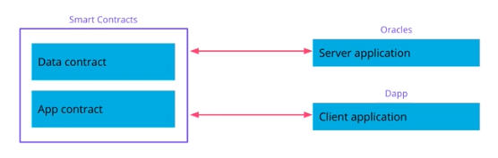

## Flight Surety Project - Overview

- Flight Surety is flight delay Insurance for Passengers
- Managed as a collaboration between multiple airlines
- Passengers purchase insurance prior to flight
- If flight is delayed due to airline fault, passengers are paid 1.5X the amount they paid for the insurance
- Oracles provide flight status information

## Architecture

- Business App
  - 앱의 구조에 비즈니스 로직이 작용
- Multi-party
  - 여러 항공사가 참여하게 된다
- Payable
  - 승객들은 항공기 탑승에 앞서 보험에 가입하므로, 거래에 대하여 Ether를 포함시킬 수 있도록 코드를 작성해야 함
- Payout
  - 만약 지연이 발생하고 환불이 필요할 때, 컨트랙트가 먼저 직접 승객에게 금액을 송금하지 않고, 승객들이 직접 *환불을 요청* 하는 함수를 실행하고, 이에 따라 송금이 이루어지도록
- Oracles

## Components

- `Data` 컨트랙트에는 데이터만 저장
- `App` 컨트랙트는 비즈니스 로직이 구현되며, 업그레이드 가능

### Server App

- Oracle
- 항공기 정보를 컨트랙트에 제공

### Client App

- DApp
  - JS, HTML, CSS
